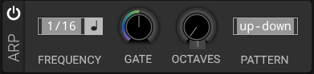

# Arpeggiator

## Overview

The arpeggiator plays held notes in sequence, creating rhythmic patterns from chords.

## Parameters

### Frequency/Rate

Speed of the arpeggiator.

- **Tempo Sync**: Musical divisions (1/4, 1/8, 1/16, etc.)
- **Free**: Independent timing in Hz

### Octaves

- **Range**: 1 to 4 octaves
- **Effect**: Range of arpeggio pattern
- **Direction**: Up, down, or both

### Gate

- **Range**: 0% to 100%
- **Effect**: Length of each arpeggiated note
- **Low values**: Staccato
- **High values**: Legato

### Pattern

Direction and order of arpeggiated notes:

- **Up**: Low to high
- **Down**: High to low
- **Up/Down**: Low to high, then high to low
- **As Played**: Order notes were pressed
- **Random**: Random order

The arpeggiator controls are **On**, **Frequency**, **Sync**, **Gate**, **Octaves**, and **Pattern**. It does not have separate Hold, Latch, or One Shot modes.

## Applications

- Rhythmic sequences from sustained chords
- Trance and electronic music patterns
- Melodic motion from static chords
- Live performance tool

## See Also

- [Step Sequencer](step-sequencer.md)
- [BPM](bpm.md)
