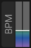

# BPM (Tempo)

## Overview

BPM (Beats Per Minute) sets the standalone tempo. In a plug-in host, tempo-synchronized modules can follow the host's tempo when it is available.

## Parameters

### Tempo

- **Range**: 20 to 300 BPM
- **Default**: 120 BPM
- **Sync**: Can sync to host DAW tempo

The BPM control sets the local tempo; there is no separate MIDI Clock input mode. In a plug-in, the host provides timing information to tempo-synchronized modules.

## Tempo-Synced Features

The following features can synchronize to tempo:

- **LFO Rate**: Musical divisions (1/4, 1/8, etc.)
- **Delay Time**: Rhythmic delays
- **Arpeggiator**: Note divisions
- **Step Sequencer**: Step timing
- **Stutter Effect**: Stutter rate and resampling rate

## Usage

### In DAW

Enable Host Sync for automatic tempo tracking.

### Standalone

Set the BPM control directly. Tempo divisions then use this value as their reference.

## See Also

- [Arp](arp.md)
- [Notes Synchro](notes-synchro.md)
