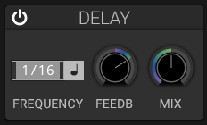

# Delay

## Overview

The delay effect creates echoes by repeating the input signal at specified intervals.

## Controls

### Frequency and Sync

- Choose free-running time or synchronize the delay to the current tempo.
- Tempo divisions include straight, dotted, and triplet values.

### Ping-Pong

The **PP** switch cross-feeds the stereo delay lines. Wet echoes alternate
between left and right; when disabled, each channel feeds back into itself.

### Feedback

- **Range**: 0% to 100%
- **Effect**: Amount of delayed signal fed back into the delay
- **High values**: Create long, evolving echoes

### Dry/Wet Mix

Balance between original signal and delayed signal.

The delay-time control is shared by both stereo channels. The section also
provides feedback, dry/wet mix, sync, ping-pong, and an on/off switch; it does
not provide separate left/right delay times or a delay-filter control.

## Applications

- Rhythmic patterns
- Spatial depth
- Ambient textures
- Doubling effects

## See Also

- [Reverb](reverb.md)
- [Distortion](distortion.md)
