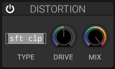

# Distortion

## Overview

The distortion effect adds harmonic content and saturation to the signal.

## Controls

### Drive

- **Range**: 0 to 100%
- **Effect**: Amount of distortion applied
- **Low values**: Subtle warmth and saturation
- **High values**: Aggressive clipping and harmonics

### Type

Choose one of the four available algorithms:

- **Soft Clip**: Smooth, tube-like saturation
- **Hard Clip**: Digital clipping, aggressive sound
- **Linear Fold**: Linear wave folding
- **Sine Fold**: Sine-based wave folding

### Mix

Blend between clean and distorted signal.

The section provides **Type**, **Drive**, **Mix**, and an on/off switch. There is no separate tone control.

## Applications

- Adding aggression to leads and basses
- Warming up cold digital sounds
- Creating lo-fi textures
- Enhancing harmonics

## See Also

- [Filter](filter.md)
- [Delay](delay.md)
