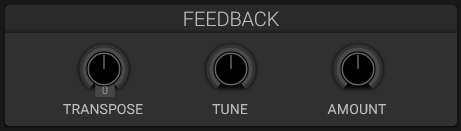

# Oscillator Feedback

## Overview

The Feedback section has three independent feedback paths: **Osc1**, **Osc2**, and **Sub + Noise**. Each path has its own Amount, Transpose, and Tune controls.

## Feedback Groups

### Osc1

Controls the feedback loop for Oscillator 1. Half of the ring-modulation signal is included in this path.

### Osc2

Controls the feedback loop for Oscillator 2. The other half of the ring-modulation signal is included in this path.

### Sub + Noise

Controls one shared feedback loop for the sub oscillator and noise source.

## Controls

- **Amount**: Sets the signed feedback level. Positive and negative values produce different feedback polarity.
- **Transpose**: Changes the note-tracked delay period in semitone steps.
- **Tune**: Fine-adjusts the delay period in cents.

Each control can also be used as a modulation destination. Existing presets load with their former shared feedback settings applied to all three groups.

## See Also

- [Oscillators](oscillators.md)
