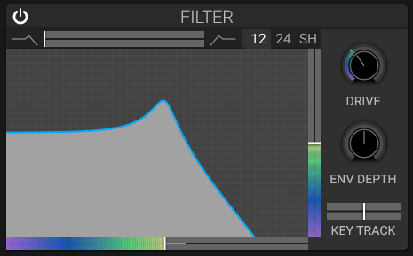

# Filter

## Overview

The filter section shapes the frequency content of the sound, removing or emphasizing certain frequencies.

## Parameters

### Cutoff Frequency

- Sets the filter's cutoff; the response display shows the resulting shape
- **Modulation**: Can be modulated by envelopes, LFOs, and keyboard tracking

### Resonance

- **Effect**: Emphasizes frequencies around the cutoff
- **High values**: Increase emphasis around the cutoff

### Filter Drive

- **Effect**: Adds saturation and harmonics to the filter
- **Character**: Adds drive and harmonic content

### Key Tracking

- **Effect**: Makes cutoff respond to the played note; positive and negative values change the direction

### Type and Blend

Choose **12 dB**, **24 dB**, **Shelf (SH)**, **Notch (N)**, or **Comb (C)** with Type. For 12 dB and 24 dB, Blend morphs from low-pass through band-pass to high-pass. Shelf uses its separate low/band/high shelf selector; Blend is not used for Shelf, Notch, or Comb. See [Filter Types](filter-types.md) for details.

## See Also

- [Filter Types](filter-types.md)
- [Filter Envelope](filter-envelope.md)
- [Formant](formant.md)
