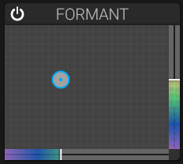

# Formant Filter

## Overview

The Formant section adds vocal-like resonances. Use its XY pad to explore different formant positions.

## Parameters

### Formant X

Horizontal position in the formant space.

- Morphs between different vowel sounds

### Formant Y

Vertical position in the formant space. Drag the XY pad to adjust X and Y together.

## Vowel Spaces

Formant positions can suggest vowel-like sounds, for example:

- A (as in "father")
- E (as in "bed")
- I (as in "see")
- O (as in "home")
- U (as in "you")

Use the section's on/off switch to enable or bypass the formant effect. There are no separate resonance or blend controls.

## Applications

- Vocal-like synthesizer sounds
- Talking bass lines
- Expressive leads
- Sound effects

## See Also

- [Filter](filter.md)
- [Modulation](modulation.md)
