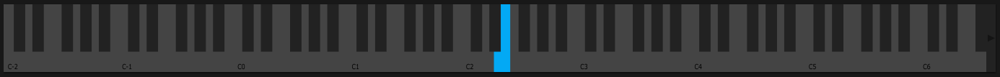

# Keyboard

## Overview

The on-screen keyboard provides visual feedback and manual note input when no MIDI controller is connected.

## Features

### Visual Feedback

- **Pressed Keys**: Highlighted when notes are active
- **Velocity**: Color intensity indicates velocity
- **Polyphony**: Shows all currently playing notes

### Mouse Input

- **Click a key**: Trigger a note
- **Multiple Notes**: Click multiple keys for chords

## Settings

### Octave Range

Displays current octave and allows shifting up/down.

The standalone edition does not use computer-keyboard typing to trigger notes.
Use the on-screen keyboard or a connected MIDI controller instead.

## Usage

### Manual Performance

- Play using the mouse or a connected MIDI controller

- Use for quick sound testing
- Useful for sound design without MIDI controller

### MIDI Input

When MIDI controller is connected:

- Keyboard shows incoming MIDI notes
- The on-screen keyboard remains available for mouse input
- Useful for monitoring note activity

## See Also

- [Keyboard Mod](keyboard-mod.md)
- [Portamento](portamento.md)
- [Voices](voices.md)
