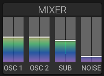

# Mixer

## Overview

The mixer section controls the balance between all sound sources before they enter the filter stage.

## Sources

### Oscillator 1

Level control for the first oscillator.

### Oscillator 2

Level control for the second oscillator.

### RM 1 / RM 2

Independent input levels for oscillators 1 and 2 in the ring modulator. These do not change the direct oscillator levels above. At 100%, they preserve the previous ring modulation level; reduce either input to attenuate the ring-modulated signal.

### Sub Oscillator

Level control for the sub oscillator.

### Noise

Level control for the noise generator.

## Output

The mixed signal is sent to the filter section for further processing.

## Tips

- Balance oscillators to avoid phase cancellation
- Use oscilloscope to visualize the mixed signal
- Adjust levels to prevent clipping before filtering

## See Also

- [Oscillators](oscillators.md)
- [Sub Oscillator](sub.md)
- [Noise](noise.md)
- [Filter](filter.md)
