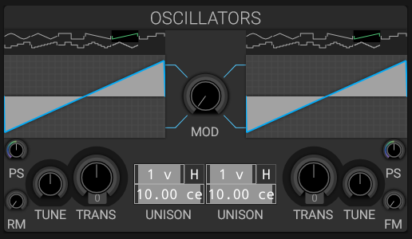

# Oscillators

## Overview

helmBoy features two primary oscillators that generate the fundamental sound.

For additional details, see [HelmBoy Oscillators Theory](helmBoy%20Oscillators%20Theory.md).

## Quick Reference

### Oscillator 1 & 2

Each oscillator provides:

- **Waveform**: 11 different waveform types
- **Transpose**: -48 to +48 semitones
- **Tune**: Fine tuning in cents
- **Unison**: Up to 15 voices with detune or harmonized intervals
- **Phase Stretch**: Waveform shape modification
- **Volume**: Independent level control

### Hard Sync

Hard Sync is off by default. When enabled, Oscillator 1 is the master: each time its phase completes a cycle, the phase of Oscillator 2 is reset. This creates a changing harmonic spectrum when the oscillators have different pitches. The reset applies to Oscillator 2's unison voices as well. `Hard Sync` is also available as a modulation destination.

### Modulation Options

- **Cross Modulation**: Mutual phase modulation between oscillators
- **FM Amount**: Oscillator 1 modulates the frequency of Oscillator 2
- **Ring Modulation**: Amplitude modulation for metallic tones

## See Also

- [Feedback](feedback.md)
- [Sub Oscillator](sub.md)
- [Mixer](mixer.md)
