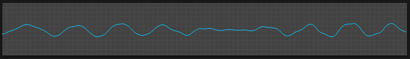

# Oscilloscope

## Overview

The oscilloscope displays a live trace of the synthesizer output waveform.

## Features

- **Live waveform display**: Shows a sampled snapshot of the current output
- **Grid**: Provides a visual reference for the trace

## Usage

Use the display to inspect:

- Oscillator waveforms and their combinations
- Filter effects on the signal
- Modulation effects
- Overall output signal shape

The oscilloscope is a display only; it has no trigger, zoom, or freeze controls.
