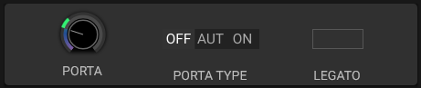

# Portamento

## Overview

Portamento (also called glide) smooths the pitch transition between notes. The Dynamic section provides a time control, a type selector, and a separate Legato switch.

## Parameters

### Portamento Time

Sets glide time in seconds per octave. The control can also be modulated.

### Portamento Type

The selector provides **Off**, **Auto**, and **On**. **Off** bypasses portamento; **Auto** and **On** enable the portamento processor with different note-trigger behavior.

### Legato

Legato is a separate toggle in the Dynamic section. It controls how overlapping notes are handled; it is not a portamento curve or envelope-retrigger selector.

## Applications

### Smooth Leads

Medium portamento time (50-200 ms) for smooth melodic lines.

### Bass Slides

Longer portamento (200-500 ms) for bass glides.

### Pitch Effects

Very long portamento (500+ ms) for special effects.

### Expressive Playing

Legato mode for natural musical phrasing.

## Usage Tips

- **Small time values**: Subtle transitions
- **Larger time values**: More pronounced slides
- **Legato**: Combine with the separate Legato toggle for connected phrases

## See Also

- [Voices](voices.md)
- [Keyboard](keyboard.md)
