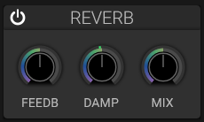

# Reverb

## Overview

The reverb effect simulates acoustic spaces, adding depth and ambience to sounds.

## Parameters

### Feedback

- Controls the amount of reverb feedback and affects the decay of the reverb tail.

### Damping

- Adjusts the damping of the reverb tail.

### Mix and Width

- **Mix**: Balances the dry and reverberated signal.
- **Width**: Adjusts the stereo width of the reverb.

### Freeze and On/Off

- **On/Off**: Enables or bypasses the reverb section from the title bar.
- **Freeze**: Activates the reverb freeze mode with a toggle at the left of the
 control area.

The feedback, damping, mix, and width knobs are arranged in a compact row at
the bottom of the section.

The current interface does not provide room-size, pre-delay, or reverb-type selectors.

## Applications

- Adding space and depth
- Creating ambient soundscapes
- Smoothing harsh sounds
- Blending multiple sound sources

## See Also

- [Delay](delay.md)
- [Volume](volume.md)
