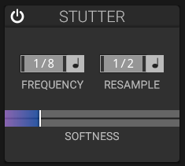

# Stutter Effect

## Overview

The stutter effect repeats short portions of the signal. Its frequency and resampling controls can be set independently.

## Parameters

### Frequency and Sync

- Set the stutter rate freely or synchronize it to straight, dotted, or triplet tempo divisions.

### Resample and Sync

- Set the resampling rate independently, either freely or with tempo divisions.

### Softness

Fades edges of stutter segments for smoother or harder cuts.

The section also has an on/off switch. It does not provide separate Gate, Mix, Window Size, or effect-type selectors.

## Applications

- EDM risers and drops
- Glitch hop effects
- Rhythmic variations
- Sound design textures
- Live performance effects

## See Also

- [Step Sequencer](step-sequencer.md)
- [Delay](delay.md)
