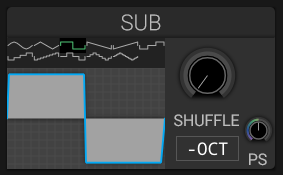

# Sub Oscillator

## Overview

The sub oscillator adds a waveform two octaves below the played note. Its **-OCT** button lowers it by one additional octave.

## Parameters

### Waveform and Phase Stretch

Choose a waveform and adjust **PS** to change its phase shape. The waveform display previews these settings.

### Shuffle

Adjusts the timing relationship within the sub waveform cycle.

### Level

Set the sub level in the [Mixer](mixer.md); the Sub panel itself has no volume control.

## Usage Tips

- Add weight to bass sounds
- Enhance kick drum synthesis
- Create sub-bass layers
- Add foundation to leads and pads

## See Also

- [Oscillators](oscillators.md)
- [Mixer](mixer.md)
