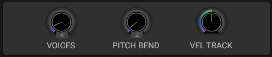

# Voice Settings

## Overview

Voice configuration determines how helmBoy handles multiple simultaneous notes.

## Parameters

### Polyphony

- **Range**: 1 to 32 voices
- **Monophonic**: 1 voice
- **Polyphonic**: Multiple voices for chords

The Voice section also provides **Pitch Bend Range** and **Velocity Track**. Legato is controlled separately in the performance section, and Portamento has its own control. Voice stealing is handled internally; there is no selectable voice-stealing mode in this section.

## See Also

- [Portamento](portamento.md)
- [Oscillators](oscillators.md)
