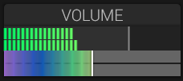

# Volume

## Overview

The Volume section controls the final output level and displays left and right output peaks.

## Parameters

### Master Volume

Adjusts the final output level.

### Peak Meters and Limiter

The Volume section displays left and right peak meters. The Limiter has a
separate section to the right of the oscilloscope, with an on/off button in its
title bar.

- **Ceiling** sets the linked stereo output ceiling from -12 dBFS to 0 dBFS.
  The default is 0 dBFS.
- **Release** sets how quickly gain reduction recovers, from 5 to 500 ms. The
  default is 100 ms.

### Pan

The **Pan** rotary control balances the existing stereo signal after the master
volume. Center (`0`) preserves both channels; moving left attenuates the right
channel, and moving right attenuates the left. It does not sum them to mono.

The limiter uses a shared peak detector for left and right, so gain reduction
preserves stereo balance. It adds no lookahead delay. Gain reduction is applied
immediately for an over-ceiling block; recovery follows the selected release.

## Usage

### Setting Output Level

1. Set a comfortable output level.
2. Watch the left and right peak meters while playing.
3. Enable the limiter when you want output limiting.

### Gain Staging

- **Oscillators**: Individual levels set in mixer
- **Filter**: Can add or remove gain
- **Effects**: Can boost or attenuate signal
- **Master Volume and Limiter**: Final output adjustment and limiting

## Level Management

### Avoiding Clipping

- Monitor output meter
- Reduce oscillator/mixer levels if clipping occurs
- Use master volume for final level adjustment
- Consider filter drive and effect levels

### Headroom

Leave 3-6 dB of headroom for:

- Dynamic range
- Mastering processing
- Preventing digital clipping

## See Also

- [Mixer](mixer.md)
- [Amplitude Envelope](amplitude-envelope.md)
