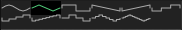

# Waveforms

## Overview

Waveform selection controls for oscillators and LFOs.

## Available Waveforms

### Oscillator Waveforms

- Sine
- Triangle
- Square
- Down Saw
- Up Saw
- Three Step
- Four Step
- Eight Step
- Three Pyramid
- Five Pyramid
- Nine Pyramid

### LFO Waveforms

- Sine
- Triangle
- Square
- Sawtooth
- Random
- Step

## Waveform Display

Visual representation shows the selected waveform shape in real-time.
